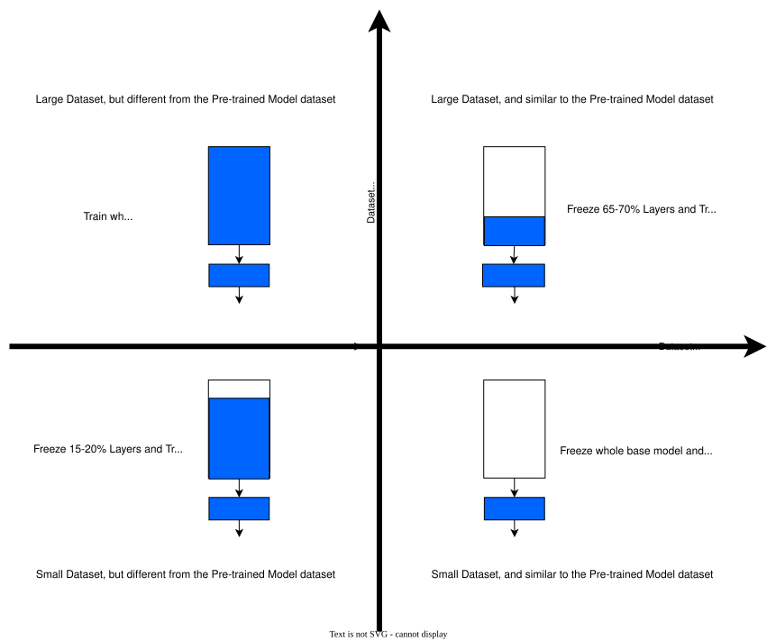

# Effective Deep Learning Training Strategies
Useful Optimized and Effective Deep Learning training strategies for improved model performance

## Table of Contents

-   [Who can benefit from this document?](#who-can-benefit-from-this-document)
-   [Why this Effective Training Strategies?](#why-this-effective-training-strategies)
-   [Classification Models](#classification-models)
    -   [Image Classification](#image-classification)
-   [Generative Models](#generative-models)
    -   [Training GAN](#training-gan)
-   [Appendix](#appendix)
    -   [Data Augmentations](#data-augmentations)
    -   [How to choose LR Scheduler?](#how-to-choose-lr-scheduler)
    -   

## Who can benefit from this document?

This guide targets both individual engineers and research teams who are interested in optimizing the performance of deep learning models. It assumes a basic understanding of machine learning and deep learning concepts.

We acknowledge that there is no universal solution that fits all scenarios. Therefore, our main focus is on offering strategies that can be commonly followed, taking into account the problem type or the characteristics of the dataset being used. These insights have been derived from experiments conducted on different categorizations. 

Our current emphasis is not on hyperparameter tuning; instead, we concentrate on a generic pipeline with parameters based on observations from personal experience.

## Why this Effective Training Strategies?

The field of deep learning currently involves a significant amount of trial and error, lacking a systematic approach for achieving optimal results. Documentation of successful strategies is scarce, with research papers often omitting crucial details and practical insights. Machine learning engineers working on real-world problems seldom have the opportunity to generalize their processes. Existing resources, such as textbooks, prioritize theoretical concepts over practical guidance. Despite the expertise of deep learning practitioners, there remains a gap between their results and those of less experienced individuals. The absence of comprehensive explanations and the prevalence of fragmented advice contribute to confusion in the community. As deep learning continues to mature and impact various domains, there is a pressing need for resources that provide practical recipes and address the essential details for achieving desirable outcomes.

## Classification Models

### Image Classification

Well a common strategy regardless of dataset charactersitics for this task is to apply Transfer Learning , choosing a pretrained model, add a custom head layer as per requirement and then train that model with several hyperparameter configuration. But we will discus strategies which are more generic and preloaded with already configured hyperparamters for specific choice of model.

Now these strategies are divided based on the Daataset Charactersisics and the choice of model. In general, considering the similarity of custom dataset with pre-trained model dataset, a problem can fall into one of these quadrants (as shown in image). 

  

- **Common to every strategy** : 
    - Data Preprocessing : Normalize Images using standard values - mean = [0.485, 0.456, 0.406] and std = [0.229, 0.224, 0.225]
    - Data splitting and Smapling : Stratified Splitting and Weighted Sampling. This helps better generalization by including samples based on clas weights or Inverse clas frequenccey.
- **Strategy 1** :  In case when classification problem falls in Quadrant 1, choose base model based on dataset complexity. If you dataset contains hard samples or complex pattern, choose either from EfficientNet or DenseNet family. Train the model from scratch( no pre-trained weights) and for longer epoch. To save training cost use Lion optimizer.
    - Batch size : [128, 256] if size_of_dataset/num_of_classes > 5k and size_of_dataset > 0.1M # keep lower value in case of less GPU memory
    - Epochs : > 50
    - Optimizer : Lion with 0.01 LR
    - Learning rate scheduler : When dealing with larger and complex datasets, along with a higher number of epochs, the CosineAnnealingLR scheduler is often a suitable choice.
- **Strategy 2** :  In case when classification problem falls in Quadrant 2, choose base model based on its Stability, Training efficiency and Top-1 Acccuracy on ImageNet Dataset. One suggestion is to pick from EfficientnetV2 family. They are designed for faster training and higher accuracy. As dataset is similar to the pretrained model dataset, a important strategy is to Freeze 70% of the base model layers and only train the remaining layers. Mostly later half layers of the models are responsible to learn and extract complex features specific to dataset. So its a good strategy to freeze around 70% layers. In case of simple dataset freeze even more layers, consider around 85-90%. And similarly for very complex try to keep it near 40%. Check this code to know How to freeze layers in Pytorch? 
    - Batch size : [128, 256] if size_of_dataset/num_of_classes > 5k and size_of_dataset > 0.1M # keep lower value in case of less GPU memory
    - Epochs : <20
    - Optimizer : Adam with 0.01 (in case of simple dataset) and 0.001 (in case of complex dataset)
    - Learning rate scheduler : ReduceLROnPlateau (in case of simple dataset) and CosineAnnealingLR (in case of complex dataset)
- **Strategy 3** :  In case when classification problem falls in Quadrant 3, choose base model based on its complexity. If you dataset contains complex pattern, choose either from EfficientNet or DenseNet family. Use stratified splitting and Weighted Sampling while creating dataloaders, so that sampling is performed based on class weights. It helps in better generaliation. To decide batch size.
    - Batch size : [128, 256] if size_of_dataset/num_of_classes > 5k and size_of_dataset > 0.1M 
    - Epochs : <20
    - Optimizer : Adam with 0.01 (in case of simple dataset) and 0.001 (in case of complex dataset)
    - Learning rate scheduler : ReduceLROnPlateau (in case of simple dataset) and CosineAnnealingLR (in case of complex dataset)
- **Strategy 4** :  In case when classification problem falls in Quadrant 1, choose base model based on its complexity. If you dataset contains complex pattern, choose either from EfficientNet or DenseNet family. Use stratified splitting and Weighted Sampling while creating dataloaders, so that sampling is performed based on class weights. It helps in better generaliation. To decide batch size.
    - Batch size : [128, 256] if size_of_dataset/num_of_classes > 5k and size_of_dataset > 0.1M 
    - Epochs : <20
    - Optimizer : Adam with 0.01 (in case of simple dataset) and 0.001 (in case of complex dataset)
    - Learning rate scheduler : ReduceLROnPlateau (in case of simple dataset) and CosineAnnealingLR (in case of complex dataset)

## Generative Models

### Training GAN

## Appendix

### Data Augmentations
-   **Why to use Data Augmentations like Random Rotation or Horzontal/Verticle Flips as CNN is robust them?** 
    -   **Increased Variability:** Data augmentation introduces additional variations in the training data, which can help improve the generalization ability of the model. By applying flips and rotations, the model becomes exposed to different viewpoints and orientations of the objects, leading to a more robust understanding of the underlying features. This can enhance the model's ability to handle variations in the test data that may include different orientations or perspectives.

    -   **Regularization:** Data augmentation serves as a form of regularization by introducing controlled noise or perturbations in the training data. Flips and rotations can act as regularization techniques that discourage overfitting and promote better generalization. By augmenting the dataset with transformed samples, the model is exposed to a wider range of examples, which can prevent the model from memorizing specific patterns and encourage it to learn more meaningful and transferable features.

    -   **Invariance is Not Absolute:** While CNNs do exhibit some degree of rotational and flip invariance, this property is not absolute. The level of invariance varies based on the specific architecture, depth, and the complexity of the task. Applying augmentations like flips and rotations can reinforce the learned invariances and help the model better generalize to unseen data. Moreover, other transformations, such as scaling, shearing, or perspective transformations, may still affect the model's performance, and augmentations can help the model become more robust to these variations.

    -   **Addressing Dataset Bias:** Some datasets may exhibit inherent biases in terms of object orientations or perspectives. By applying flips and rotations, you can mitigate such biases and ensure that the model is exposed to a more diverse range of examples. This can help the model learn more representative and unbiased features, leading to improved performance on unseen data.

-   **When to not apply data augmentations?**
    -   Domain-specific Constraints: Certain domains or tasks have specific constraints that make rotational or flip augmentations inappropriate. For example, in tasks where the orientation or symmetry of objects is critical, applying rotations or flips may introduce unrealistic or incorrect variations. Medical imaging or certain scientific domains might fall under this category, where maintaining the anatomical correctness or physical properties of the data is crucial.

    -   Pretrained Models: If you're using a pretrained model that was trained without rotational or flip augmentations, it may be best to avoid introducing these augmentations during fine-tuning or transfer learning. Consistency between the augmentation techniques used during pre-training and fine-tuning is important to ensure that the learned representations are coherent.

    -   Limited Data Availability: When the dataset is limited in size, applying rotational or flip augmentations may not be necessary. In such cases, it's more important to focus on preserving and utilizing the available authentic data rather than introducing synthetic variations. Over-augmentation with limited data may lead to overfitting or introducing unrealistic patterns.

    -   Task-specific Constraints: Some tasks have inherent constraints that make rotational or flip augmentations undesirable. For example, in text recognition tasks, flipping or rotating text images would result in unreadable or distorted text, hindering the model's ability to learn meaningful representations. Similarly, for tasks that require precise object localization or bounding box predictions, applying flips or rotations can complicate the task and make accurate localization more challenging.

    -   Computational Efficiency: Applying rotational or flip augmentations increases the computational cost during training. If computational resources are limited or if you're working with a large dataset, it may be more practical to focus on other augmentations that provide similar benefits while being less computationally demanding.

### How to choose LR Scheduler?

-   StepLR: The StepLR scheduler reduces the learning rate by a factor at specified step intervals. It is suitable when the dataset is large, and the training duration is relatively long. This scheduler allows for a gradual decrease in the learning rate, which can be effective in finding a good minima in the loss landscape.

-   ReduceLROnPlateau: This scheduler monitors the validation loss and reduces the learning rate if the loss plateaus. It is particularly useful when training starts to stagnate or the model is close to convergence. It can adapt the learning rate based on the model's performance on the validation set, making it beneficial for datasets of any size and varying training durations.

-   CosineAnnealingLR: The CosineAnnealingLR scheduler gradually reduces the learning rate following a cosine annealing schedule. It is effective when there is a specific number of epochs planned, and the model needs to explore different regions of the loss landscape. This scheduler can help the model escape poor local minima and potentially converge to a better solution.

-   OneCycleLR: The OneCycleLR scheduler is designed to achieve faster convergence and better generalization. It starts with a lower learning rate, gradually increases it, and then decreases it towards the end of training. This scheduler is suitable for smaller datasets and can be effective when used with cyclic learning rate policies.

-   ExponentialLR: The ExponentialLR scheduler multiplies the learning rate by a specified factor at each epoch. It is useful when you want a more aggressive learning rate reduction throughout the training process. However, it may require careful tuning of the factor to ensure stability.
